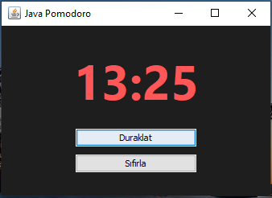

# 🍅 Java Pomodoro Focus Timer

Basit, hızlı ve etkili bir odaklanma aracı. Java Swing kütüphanesi kullanılarak geliştirilen bu masaüstü uygulaması, Pomodoro tekniğini uygulamanıza yardımcı olur.

## ✨ Özellikler

- **25 Dakikalık Sayaç:** Odaklanma seanslarını yönetmek için optimize edilmiştir.
- **Kullanıcı Dostu Arayüz:** Duraklatma, devam etme ve sıfırlama özelliklerine sahip minimalist tasarım.
- **Karanlık Mod:** Göz yormayan koyu tema arayüzü.
- **Sıfır Bağımlılık:** Harici bir kütüphane gerektirmez, doğrudan Java ile çalışır.

## 🌇 Önizleme ve ekran görüntüleri


## 🚀 Kurulum ve Çalıştırma

### Gereksinimler
- **JDK 11** veya üzeri yüklü olmalıdır.

### Çalıştırma Adımları
1. Bu depoyu klonlayın:
   ```bash
   git clone https://github.com/picomve/PomodoroTimer.git
